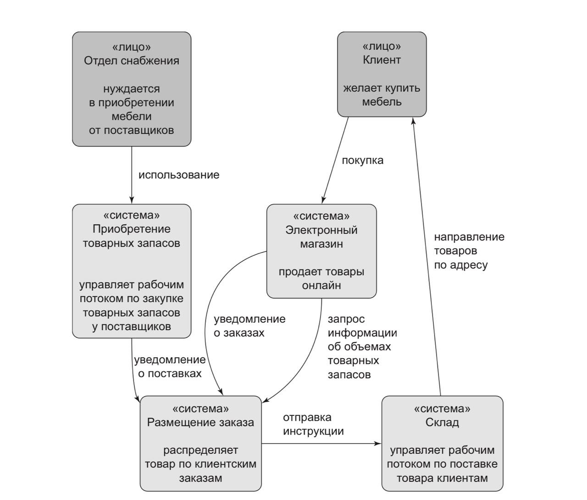

# Служба размещения заказов

## Описание предметной области

Продукт идентифицируется по артикулу, или единице складского учета (stock-
keeping unit, SKU). Клиенты (customers) делают заказы (orders). Заказ иденти-
фицируется ссылкой на заказ (order reference) и состоит из нескольких товарных
позиций, или строк (order lines), где каждая товарная позиция имеет артикул
и количество (quantity). Например:
y 10 шт. артикула СТУЛ-КРАСНЫЙ;
y 1 шт. артикула ЛАМПА-БЕЗВКУСНАЯ.
Отдел закупок заказывает малые партии (batches) товара. Партия товара имеет
уникальный идентификатор, именуемый ссылкой, артикулом и количеством.
Нужно разместить товарные позиции заказа (allocate order lines) в партиях товара.
После того как мы это сделали, мы отправляем товар из этой конкретной партии
на клиентский адрес доставки. Когда мы размещаем x штук в партии товара, то
его располагаемое количество (available quantity) уменьшается на x. Например:
y у нас есть партия из 20 шт. артикула СТОЛ-МАЛЫЙ, и мы размещаем в ней
товарную позицию на 2 шт. артикула СТОЛ-МАЛЫЙ;
y в партии товара должно остаться 18 шт. артикула СТОЛ-МАЛЫЙ.
Мы не можем размещать товарные позиции заказа, если располагаемое количество
меньше количества в товарной позиции. Например:
y у нас есть партия из 1 шт. артикула ПОДУШКА-СИНЯЯ и товарная позиция
на 2 шт. артикула ПОДУШКА-СИНЯЯ;
y мы не можем разместить эту позицию в партии товара.
Мы не можем размещать одну и ту же товарную позицию заказа дважды. Например:
y у нас есть партия из 10 шт. артикула ВАЗА-СИНЯЯ, и мы размещаем товарную
позицию на 2 шт. артикула ВАЗА-СИНЯЯ;
y если снова разместить эту позицию в той же партии товара, то указанная партия
все равно должна иметь количество 8 шт.
Партии товара имеют предполагаемый срок прибытия (estimated arrival time, ETA),
если они в настоящее время в пути, либо они могут быть на складе (warehouse stock).
Складские партии имеют приоритет в размещении. Приоритет партий в пути за-
висит от их предполагаемого срока прибытия — чем раньше срок, тем более партия приоритетна к размещению.

- SKU (артикул) - уникальный идентификатор товара, который используется для его учета и отслеживания в системе.
- Customers (клиенты) - лица или организации, которые приобретают товары или услуги.
- Orders (заказы) - запросы клиентов на покупку товаров или услуг, которые могут включать несколько SKU.
- Order Items (позиции заказа) - отдельные товары или услуги, которые входят в состав заказа.
- Quantity (количество) - количество единиц товара или услуги, которые клиент заказывает.
- Batch (партия) - группа товаров, которые были произведены или собраны вместе и имеют одинаковые характеристики.
- Allocate order lines (выделение позиций заказа) - процесс распределения товаров или услуг между заказами, чтобы обеспечить их выполнение.
- Available quantity (доступное количество) - количество товаров или услуг, которые доступны для продажи или выполнения заказа.
- Estimated arrival time (ETA) (предполагаемое время прибытия) - ожидаемое время, когда товар или услуга будут доступны для продажи или выполнения заказа.
- Warehouse stock (складские запасы) - количество товаров или услуг, которые находятся на складе и готовы к продаже или выполнению заказа.

## Диаграмма для службы размещения заказов
