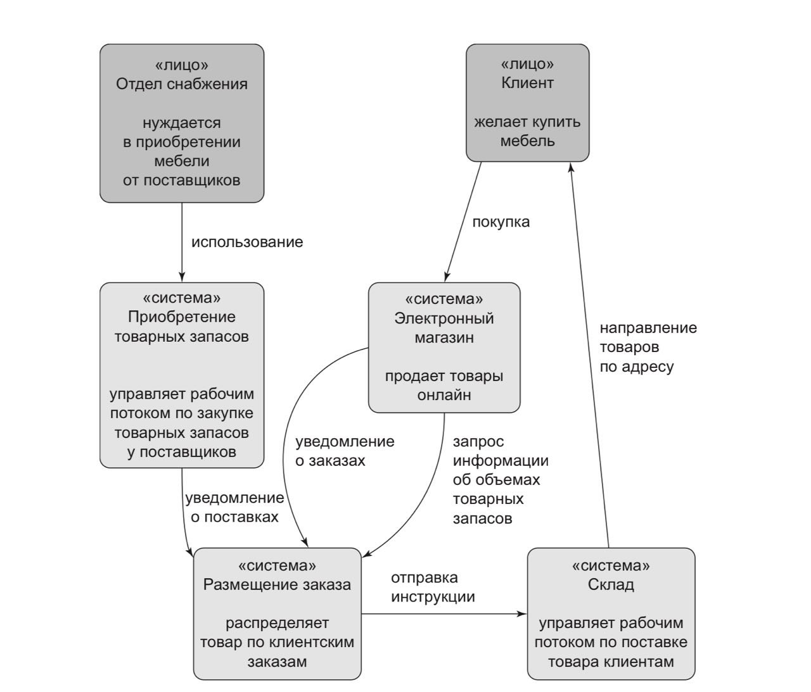

# Welcome to the Online Shop Project Documentation

## About the Project

This project is a modern order allocation service built using Domain-Driven Design (DDD), Clean Architecture, and Onion Architecture. It is designed for managing orders, product batches, and their allocation in a warehouse, with a focus on scalability, testability, and code clarity.

## Goals
- Efficient management of orders and product batches
- Flexible architecture for easy extension and maintenance
- High test coverage (TDD)
- Easy onboarding for new developers

## Main Entities
- **SKU** — unique product identifier
- **Customers** — individuals or organizations placing orders
- **Orders** — customer requests for products
- **Batches** — groups of products with unique characteristics
- **Order line allocation** — process of distributing products among batches

## Diagram

## Glossary
- **OrderLine** — order line item
- **Batch** — product batch
- **Product** — aggregate that groups batches
- **Allocation** — allocation of an order line to a batch

## Quick Start
- [Installation & Launch Guide](install.md)
- [Architecture & Patterns](archeticture/components.md)
- [REST API](api/rest.md)
- [FAQ](faq.md)

